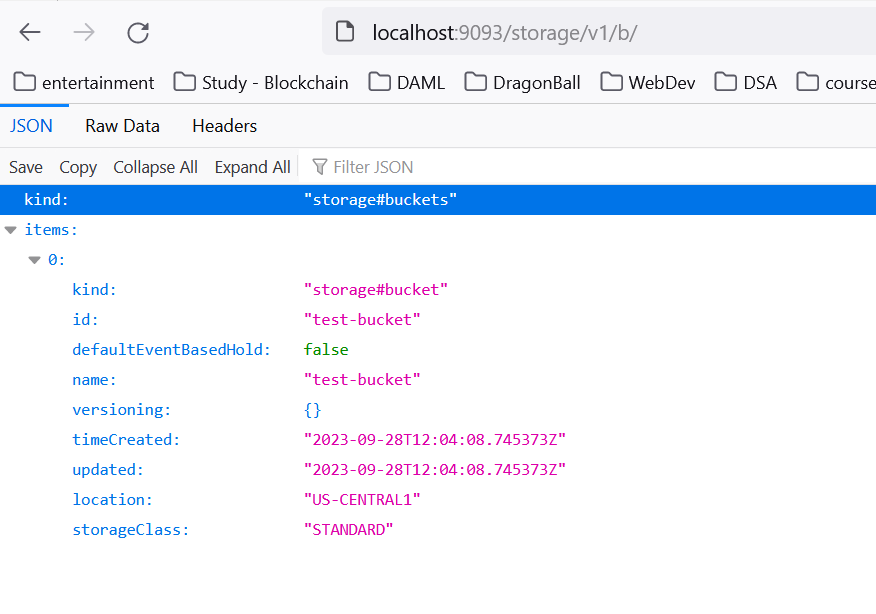

# GCS

# Using Google Cloud Storage in spring boot using fake-gcs-server :

## Setup GCS server on local system using Docker

- Install docker on the system
- Create a folder in the system to act as gcs storage server. (eg folder with name fake-gcs-server). Then create a sub-folder to be used as bucket(eg fake-gcs-server/test-bucket)
- Run the below command to download and run the fake-gcs-server
- docker run -d --name fake-gcs-server -p 9093:4443 -v C:/work/fake-gcs-server:/storage fsouza/fake-gcs-server -scheme http
- Verify if the fake server is running by opening below url in browser :
    
    [http://localhost:9093/storage/v1/b/](http://localhost:9093/storage/v1/b/)
    
    It will look something like below. This indicates that the server is running and there is a bucket “test-bucket” created, which can be used to store files or folders
    
    
    

## Setup Spring Boot Project :

- Go to  [https://start.spring.io/](https://start.spring.io/) and configure like below
    
    
    
- Click on Generate to download this starter project
- Extract the downloaded project
- Open Eclipse IDE and create a workspace
- Click on **Import Projects** and select **Existing Maven Projects** and click next
    
    
    
- Browse the location of extracted project
    
    
    
- Click Finish
- IDE will start importing the maven project and required dependencies.
- Once the project gets imported, the project structure will like below
    
    
    
- Right Click on [GcsApplication.java](http://GcsApplication.java) file, and select Run As —>Java Application
    
    
    
- We should see the application logs with some errors “java.io.IOException: Your default credentials were not found. To set up Application Default Credentials for your environment, see [https://cloud.google.com/docs/authentication/external/set-up-adc](https://cloud.google.com/docs/authentication/external/set-up-adc).”
    
    
    
- These errors are occurs since we have added dependency of “GSCP Storage” in the project. This dependency expects the credentials to be supplied in [application.properties](http://application.properties) file (ServiceAccountKey files) to auto-configure Google cloud storage bean to connect to GCS bucket. But since we are using containerized fake-gcs-server instead of actual GCS server, we wont have these credentials. So we want to override the process of creating Storage bean to use no credentials and use our fake-gcs-server url instead of actual gcs bucket.
- To override the Storage bean and run the application without credentials, create a file (GcsConfig.java inside a new package, com.sankidev.gcs.config) annotated with @Configuration and add below 2 methods in it.
    
    ```java
    package com.sankidev.gcs.config;
    
    import org.springframework.context.annotation.Bean;
    import org.springframework.context.annotation.Configuration;
    
    import com.google.api.gax.core.CredentialsProvider;
    import com.google.api.gax.core.NoCredentialsProvider;
    import com.google.cloud.NoCredentials;
    import com.google.cloud.storage.Storage;
    import com.google.cloud.storage.StorageOptions;
    
    @Configuration
    public class GcsConfig {
    
    	@Bean
    	public Storage getStorage() {
    		Storage storageClient = StorageOptions.newBuilder().setHost("http://localhost:9093/")
    				.setProjectId("test-project").setCredentials(NoCredentials.getInstance()).build().getService();
    		return storageClient;
    	}
    
    	@Bean
    	public CredentialsProvider credentialsProvider() {
    		return () -> NoCredentialsProvider.create().getCredentials();
    	}
    }
    ```
    
- Now re-run the application. Application will run fine without any errors now.

## Create base structure for the codebase :

To modularize the application, we we split our code into different parts, eg, controller, service, dao. We create separate packages for these parts and keep the corresponding java files in the packages.

- Create a new package com.sankidev.gcs.controller and create a new Class in this package called [GCSController.java](http://GCSController.java) and annotate this class with @RestController
- Create a new package com.sankidev.gcs.controller and create a new Class in this package called GCSService and annotate this class with @Service
- Configure properties such as bucket name , max and min file sizes, etc in [application.properties](http://application.properties) file. the value for [gcp.bucket.name](http://gcp.bucket.name) property should match with the bucket created while etting up the local fake-gcs-server
    
    ```
    gcp.bucket.name=test-bucket
    
    spring.servlet.multipart.max-file-size=10MB
    spring.servlet.multipart.max-request-size=10MB
    ```
    

## Uploading file

### **Creating Service method :**

- Modify the [GCSService.java](http://GCSService.java) class as follows :
    
    ```java
    package com.sankidev.gcs.service;
    
    import java.io.IOException;
    
    import org.springframework.beans.factory.annotation.Autowired;
    import org.springframework.beans.factory.annotation.Value;
    import org.springframework.stereotype.Service;
    import org.springframework.web.multipart.MultipartFile;
    
    import com.google.cloud.storage.Blob;
    import com.google.cloud.storage.BlobId;
    import com.google.cloud.storage.BlobInfo;
    import com.google.cloud.storage.Storage;
    
    @Service
    public class GCSService {
    
    	@Value("${gcp.bucket.name}")
    	private String bucketName;
    
    	@Autowired
    	private Storage storage;
    
    	public boolean upload(MultipartFile file) throws IOException {
    		BlobId blobId = BlobId.of(bucketName, file.getOriginalFilename());
    		BlobInfo blobInfo = BlobInfo.newBuilder(blobId).setContentType(file.getContentType()).build();
    		storage.create(blobInfo, file.getBytes());
    		return true;
    	}
    }
    ```
    

### Creating Controller

- Modify [GCSController.java](http://GCSController.java) file as below
    
    ```java
    package com.sankidev.gcs.controller;
    
    import java.io.IOException;
    
    import org.springframework.beans.factory.annotation.Autowired;
    import org.springframework.http.ResponseEntity;
    import org.springframework.web.bind.annotation.PostMapping;
    import org.springframework.web.bind.annotation.RequestMapping;
    import org.springframework.web.bind.annotation.RequestParam;
    import org.springframework.web.bind.annotation.RestController;
    import org.springframework.web.multipart.MultipartFile;
    
    import com.sankidev.gcs.service.GCSService;
    
    @RestController
    @RequestMapping("/api")
    public class GCSController {
    
    	@Autowired
    	private GCSService gcsService;
    
    	@PostMapping("/upload")
    	public ResponseEntity<String> upload(@RequestParam MultipartFile file) throws IOException {
    
    		boolean uploaded = gcsService.upload(file);
    		if (uploaded) {
    			return ResponseEntity.ok("File uploaded successfully");
    		} else {
    			return ResponseEntity.ok("File uploaded successfully");
    		}
    	}
    }
    ```